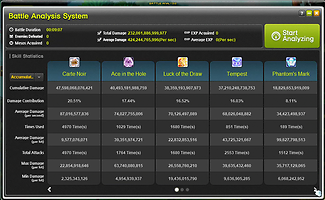
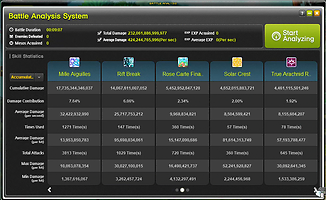
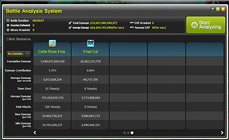
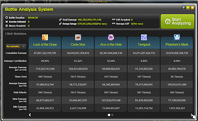

# results

## description
There are 2 sets of results presented here, you should make your choice based
on which scenario best fits the content you want to complete after New Age.

You can also run the code in this repo yourself, if you want to customize the
results given.

### assumptions

  - -4 hat
  - Ring of Restraint 4
  - 250 Mercedes Legion
  - 300 PDR
  - 88% attack
  - 97.74% sheet IED
  - 750 damage + boss (dummy ba) 900 damage + boss (hseren bishop + kanna)

### dummy ba
[](img/dummy_ba_1.png)
[](img/dummy_ba_2.png)
[](img/dummy_ba_3.png)

This is a dummy BA, but not a standard 2:50 DPM BA. Instead, it is fully
buffed, and ~9 minutes with 4 bursts, starting and ending on a burst
(effectively, a 12 min DPM BA, but intentionally missing the last 3 minutes of
DPM).

The general idea here is that, frequently, your bosses will start and end on a
burst. Therefore, we should not be trying to optimize for a BA that ends right
before the burst comes back up, as that will deflate the contribution of our
front-loaded burst more than would realistically occur in bosses. 9 minutes was
arbitrarily chosen here (rather than something like 3 minutes) to avoid skewing
the results too far towards the burst skills.

You should use this if you want to optimize for solo, high-Tempest-uptime
bosses after New Age.

### hard seren p2 ft. bishop + kanna
[](img/hseren_ba_1.png)
[](img/hseren_ba_2.png)

This is a 4.5 minute, 2 burst Hard Seren P2 BA (roughly equivalent to the 9
minute 4 burst dummy BA above). Thanks to mostly Benediction, this skews the BA
contribution very far in favor of Luck of the Draw. Seren is also a boss where
Tempest uptime is difficult.

You should use this if you want to optimize for party, low-Tempest-uptime
bosses after New Age.

## sol erda fragments are the bottleneck

### based on a dummy ba
```
Cost: 0        FD Gain: 12.71%    FD/cost:            Origin: 1     Mastery: 0     LotD: 0     Ace: 0     Mark: 0     Rift Break: 0
Cost: 75       FD Gain: 14.63%    FD/cost: 0.0225%    Origin: 1     Mastery: 0     LotD: 0     Ace: 1     Mark: 0     Rift Break: 0
Cost: 150      FD Gain: 16.45%    FD/cost: 0.0210%    Origin: 1     Mastery: 0     LotD: 1     Ace: 1     Mark: 0     Rift Break: 0
Cost: 180      FD Gain: 16.86%    FD/cost: 0.0117%    Origin: 2     Mastery: 0     LotD: 1     Ace: 1     Mark: 0     Rift Break: 0
Cost: 255      FD Gain: 17.75%    FD/cost: 0.0101%    Origin: 2     Mastery: 0     LotD: 1     Ace: 1     Mark: 1     Rift Break: 0
Cost: 290      FD Gain: 18.16%    FD/cost: 0.0099%    Origin: 3     Mastery: 0     LotD: 1     Ace: 1     Mark: 1     Rift Break: 0
Cost: 532      FD Gain: 20.87%    FD/cost: 0.0094%    Origin: 3     Mastery: 9     LotD: 1     Ace: 1     Mark: 1     Rift Break: 0
Cost: 617      FD Gain: 21.69%    FD/cost: 0.0080%    Origin: 5     Mastery: 9     LotD: 1     Ace: 1     Mark: 1     Rift Break: 0
Cost: 692      FD Gain: 22.35%    FD/cost: 0.0073%    Origin: 5     Mastery: 9     LotD: 1     Ace: 1     Mark: 1     Rift Break: 1
Cost: 742      FD Gain: 22.76%    FD/cost: 0.0067%    Origin: 6     Mastery: 9     LotD: 1     Ace: 1     Mark: 1     Rift Break: 1
Cost: 765      FD Gain: 22.94%    FD/cost: 0.0062%    Origin: 6     Mastery: 9     LotD: 1     Ace: 2     Mark: 1     Rift Break: 1
Cost: 820      FD Gain: 23.35%    FD/cost: 0.0061%    Origin: 7     Mastery: 9     LotD: 1     Ace: 2     Mark: 1     Rift Break: 1
Cost: 843      FD Gain: 23.51%    FD/cost: 0.0058%    Origin: 7     Mastery: 9     LotD: 2     Ace: 2     Mark: 1     Rift Break: 1
Cost: 903      FD Gain: 23.92%    FD/cost: 0.0055%    Origin: 8     Mastery: 9     LotD: 2     Ace: 2     Mark: 1     Rift Break: 1
Cost: 930      FD Gain: 24.10%    FD/cost: 0.0052%    Origin: 8     Mastery: 9     LotD: 2     Ace: 3     Mark: 1     Rift Break: 1
Cost: 995      FD Gain: 24.51%    FD/cost: 0.0051%    Origin: 9     Mastery: 9     LotD: 2     Ace: 3     Mark: 1     Rift Break: 1
Cost: 1022     FD Gain: 24.67%    FD/cost: 0.0049%    Origin: 9     Mastery: 9     LotD: 3     Ace: 3     Mark: 1     Rift Break: 1
Cost: 1312     FD Gain: 26.40%    FD/cost: 0.0047%    Origin: 9     Mastery: 14    LotD: 3     Ace: 3     Mark: 1     Rift Break: 1
Cost: 1342     FD Gain: 26.58%    FD/cost: 0.0046%    Origin: 9     Mastery: 14    LotD: 3     Ace: 4     Mark: 1     Rift Break: 1
Cost: 1402     FD Gain: 26.92%    FD/cost: 0.0045%    Origin: 9     Mastery: 15    LotD: 3     Ace: 4     Mark: 1     Rift Break: 1
Cost: 1432     FD Gain: 27.09%    FD/cost: 0.0043%    Origin: 9     Mastery: 15    LotD: 4     Ace: 4     Mark: 1     Rift Break: 1
Cost: 1790     FD Gain: 29.00%    FD/cost: 0.0042%    Origin: 9     Mastery: 15    LotD: 4     Ace: 10    Mark: 1     Rift Break: 1
Cost: 1855     FD Gain: 29.35%    FD/cost: 0.0041%    Origin: 9     Mastery: 16    LotD: 4     Ace: 10    Mark: 1     Rift Break: 1
Cost: 2213     FD Gain: 31.17%    FD/cost: 0.0039%    Origin: 9     Mastery: 16    LotD: 10    Ace: 10    Mark: 1     Rift Break: 1
Cost: 2438     FD Gain: 32.20%    FD/cost: 0.0035%    Origin: 9     Mastery: 19    LotD: 10    Ace: 10    Mark: 1     Rift Break: 1
Cost: 3018     FD Gain: 34.46%    FD/cost: 0.0029%    Origin: 14    Mastery: 19    LotD: 10    Ace: 10    Mark: 1     Rift Break: 1
Cost: 3041     FD Gain: 34.54%    FD/cost: 0.0026%    Origin: 14    Mastery: 19    LotD: 10    Ace: 10    Mark: 2     Rift Break: 1
Cost: 3291     FD Gain: 35.37%    FD/cost: 0.0025%    Origin: 16    Mastery: 19    LotD: 10    Ace: 10    Mark: 2     Rift Break: 1
Cost: 4051     FD Gain: 37.79%    FD/cost: 0.0023%    Origin: 16    Mastery: 26    LotD: 10    Ace: 10    Mark: 2     Rift Break: 1
Cost: 4078     FD Gain: 37.87%    FD/cost: 0.0022%    Origin: 16    Mastery: 26    LotD: 10    Ace: 10    Mark: 3     Rift Break: 1
Cost: 4193     FD Gain: 38.22%    FD/cost: 0.0022%    Origin: 16    Mastery: 27    LotD: 10    Ace: 10    Mark: 3     Rift Break: 1
Cost: 4333     FD Gain: 38.63%    FD/cost: 0.0021%    Origin: 17    Mastery: 27    LotD: 10    Ace: 10    Mark: 3     Rift Break: 1
Cost: 4393     FD Gain: 38.81%    FD/cost: 0.0021%    Origin: 17    Mastery: 27    LotD: 10    Ace: 11    Mark: 3     Rift Break: 1
Cost: 4513     FD Gain: 39.15%    FD/cost: 0.0021%    Origin: 17    Mastery: 28    LotD: 10    Ace: 11    Mark: 3     Rift Break: 1
Cost: 4663     FD Gain: 39.57%    FD/cost: 0.0020%    Origin: 18    Mastery: 28    LotD: 10    Ace: 11    Mark: 3     Rift Break: 1
Cost: 4788     FD Gain: 39.91%    FD/cost: 0.0020%    Origin: 18    Mastery: 29    LotD: 10    Ace: 11    Mark: 3     Rift Break: 1
Cost: 4848     FD Gain: 40.08%    FD/cost: 0.0020%    Origin: 18    Mastery: 29    LotD: 11    Ace: 11    Mark: 3     Rift Break: 1
Cost: 4878     FD Gain: 40.16%    FD/cost: 0.0019%    Origin: 18    Mastery: 29    LotD: 11    Ace: 11    Mark: 4     Rift Break: 1
Cost: 4901     FD Gain: 40.22%    FD/cost: 0.0019%    Origin: 18    Mastery: 29    LotD: 11    Ace: 11    Mark: 4     Rift Break: 2
Cost: 5411     FD Gain: 41.54%    FD/cost: 0.0018%    Origin: 20    Mastery: 29    LotD: 11    Ace: 11    Mark: 4     Rift Break: 2
Cost: 5479     FD Gain: 41.71%    FD/cost: 0.0018%    Origin: 20    Mastery: 29    LotD: 11    Ace: 12    Mark: 4     Rift Break: 2
Cost: 5649     FD Gain: 42.14%    FD/cost: 0.0018%    Origin: 21    Mastery: 29    LotD: 11    Ace: 12    Mark: 4     Rift Break: 2
Cost: 6007     FD Gain: 43.03%    FD/cost: 0.0017%    Origin: 21    Mastery: 29    LotD: 11    Ace: 12    Mark: 10    Rift Break: 2
Cost: 6075     FD Gain: 43.19%    FD/cost: 0.0017%    Origin: 21    Mastery: 29    LotD: 12    Ace: 12    Mark: 10    Rift Break: 2
Cost: 7022     FD Gain: 45.46%    FD/cost: 0.0017%    Origin: 21    Mastery: 29    LotD: 12    Ace: 20    Mark: 10    Rift Break: 2
Cost: 9242     FD Gain: 50.61%    FD/cost: 0.0016%    Origin: 30    Mastery: 29    LotD: 12    Ace: 20    Mark: 10    Rift Break: 2
Cost: 10189    FD Gain: 52.75%    FD/cost: 0.0015%    Origin: 30    Mastery: 29    LotD: 20    Ace: 20    Mark: 10    Rift Break: 2
Cost: 10246    FD Gain: 52.88%    FD/cost: 0.0014%    Origin: 30    Mastery: 29    LotD: 20    Ace: 20    Mark: 10    Rift Break: 4
Cost: 12041    FD Gain: 56.36%    FD/cost: 0.0013%    Origin: 30    Mastery: 29    LotD: 20    Ace: 30    Mark: 10    Rift Break: 4
Cost: 12399    FD Gain: 57.03%    FD/cost: 0.0012%    Origin: 30    Mastery: 29    LotD: 20    Ace: 30    Mark: 10    Rift Break: 10
Cost: 14194    FD Gain: 60.33%    FD/cost: 0.0012%    Origin: 30    Mastery: 29    LotD: 30    Ace: 30    Mark: 10    Rift Break: 10
Cost: 14444    FD Gain: 60.68%    FD/cost: 0.0009%    Origin: 30    Mastery: 30    LotD: 30    Ace: 30    Mark: 10    Rift Break: 10
Cost: 15519    FD Gain: 61.90%    FD/cost: 0.0007%    Origin: 30    Mastery: 30    LotD: 30    Ace: 30    Mark: 20    Rift Break: 10
Cost: 15579    FD Gain: 61.96%    FD/cost: 0.0006%    Origin: 30    Mastery: 30    LotD: 30    Ace: 30    Mark: 20    Rift Break: 11
Cost: 17374    FD Gain: 63.58%    FD/cost: 0.0006%    Origin: 30    Mastery: 30    LotD: 30    Ace: 30    Mark: 30    Rift Break: 11
Cost: 20184    FD Gain: 65.64%    FD/cost: 0.0004%    Origin: 30    Mastery: 30    LotD: 30    Ace: 30    Mark: 30    Rift Break: 30
```

### based on hard seren p2 ft. bishop + kanna
```
Cost: 0        FD Gain: 23.04%    FD/cost:            Origin: 1     Mastery: 0     LotD: 0     Ace: 0     Mark: 0     Rift Break: 0
Cost: 75       FD Gain: 26.33%    FD/cost: 0.0352%    Origin: 1     Mastery: 0     LotD: 1     Ace: 0     Mark: 0     Rift Break: 0
Cost: 105      FD Gain: 27.07%    FD/cost: 0.0196%    Origin: 2     Mastery: 0     LotD: 1     Ace: 0     Mark: 0     Rift Break: 0
Cost: 180      FD Gain: 28.88%    FD/cost: 0.0188%    Origin: 2     Mastery: 0     LotD: 1     Ace: 1     Mark: 0     Rift Break: 0
Cost: 405      FD Gain: 32.60%    FD/cost: 0.0126%    Origin: 7     Mastery: 0     LotD: 1     Ace: 1     Mark: 0     Rift Break: 0
Cost: 428      FD Gain: 32.90%    FD/cost: 0.0098%    Origin: 7     Mastery: 0     LotD: 2     Ace: 1     Mark: 0     Rift Break: 0
Cost: 488      FD Gain: 33.64%    FD/cost: 0.0093%    Origin: 8     Mastery: 0     LotD: 2     Ace: 1     Mark: 0     Rift Break: 0
Cost: 563      FD Gain: 34.53%    FD/cost: 0.0088%    Origin: 8     Mastery: 0     LotD: 2     Ace: 1     Mark: 1     Rift Break: 0
Cost: 628      FD Gain: 35.27%    FD/cost: 0.0085%    Origin: 9     Mastery: 0     LotD: 2     Ace: 1     Mark: 1     Rift Break: 0
Cost: 1043     FD Gain: 39.16%    FD/cost: 0.0068%    Origin: 9     Mastery: 0     LotD: 10    Ace: 1     Mark: 1     Rift Break: 0
Cost: 1118     FD Gain: 39.82%    FD/cost: 0.0063%    Origin: 9     Mastery: 0     LotD: 10    Ace: 1     Mark: 1     Rift Break: 1
Cost: 1141     FD Gain: 39.98%    FD/cost: 0.0051%    Origin: 9     Mastery: 0     LotD: 10    Ace: 2     Mark: 1     Rift Break: 1
Cost: 1841     FD Gain: 44.82%    FD/cost: 0.0049%    Origin: 15    Mastery: 0     LotD: 10    Ace: 2     Mark: 1     Rift Break: 1
Cost: 1868     FD Gain: 44.99%    FD/cost: 0.0042%    Origin: 15    Mastery: 0     LotD: 10    Ace: 3     Mark: 1     Rift Break: 1
Cost: 1998     FD Gain: 45.74%    FD/cost: 0.0040%    Origin: 16    Mastery: 0     LotD: 10    Ace: 3     Mark: 1     Rift Break: 1
Cost: 2240     FD Gain: 47.10%    FD/cost: 0.0038%    Origin: 16    Mastery: 9     LotD: 10    Ace: 3     Mark: 1     Rift Break: 1
Cost: 2270     FD Gain: 47.27%    FD/cost: 0.0037%    Origin: 16    Mastery: 9     LotD: 10    Ace: 4     Mark: 1     Rift Break: 1
Cost: 2410     FD Gain: 48.02%    FD/cost: 0.0036%    Origin: 17    Mastery: 9     LotD: 10    Ace: 4     Mark: 1     Rift Break: 1
Cost: 2768     FD Gain: 49.83%    FD/cost: 0.0034%    Origin: 17    Mastery: 9     LotD: 10    Ace: 10    Mark: 1     Rift Break: 1
Cost: 2918     FD Gain: 50.58%    FD/cost: 0.0033%    Origin: 18    Mastery: 9     LotD: 10    Ace: 10    Mark: 1     Rift Break: 1
Cost: 2978     FD Gain: 50.88%    FD/cost: 0.0033%    Origin: 18    Mastery: 9     LotD: 11    Ace: 10    Mark: 1     Rift Break: 1
Cost: 3138     FD Gain: 51.63%    FD/cost: 0.0031%    Origin: 19    Mastery: 9     LotD: 11    Ace: 10    Mark: 1     Rift Break: 1
Cost: 3206     FD Gain: 51.93%    FD/cost: 0.0029%    Origin: 19    Mastery: 9     LotD: 12    Ace: 10    Mark: 1     Rift Break: 1
Cost: 3906     FD Gain: 54.97%    FD/cost: 0.0028%    Origin: 22    Mastery: 9     LotD: 12    Ace: 10    Mark: 1     Rift Break: 1
Cost: 4853     FD Gain: 58.85%    FD/cost: 0.0026%    Origin: 22    Mastery: 9     LotD: 20    Ace: 10    Mark: 1     Rift Break: 1
Cost: 6893     FD Gain: 67.14%    FD/cost: 0.0025%    Origin: 30    Mastery: 9     LotD: 20    Ace: 10    Mark: 1     Rift Break: 1
Cost: 6916     FD Gain: 67.23%    FD/cost: 0.0021%    Origin: 30    Mastery: 9     LotD: 20    Ace: 10    Mark: 2     Rift Break: 1
Cost: 7206     FD Gain: 68.18%    FD/cost: 0.0020%    Origin: 30    Mastery: 14    LotD: 20    Ace: 10    Mark: 2     Rift Break: 1
Cost: 9001     FD Gain: 74.16%    FD/cost: 0.0019%    Origin: 30    Mastery: 14    LotD: 30    Ace: 10    Mark: 2     Rift Break: 1
Cost: 9061     FD Gain: 74.36%    FD/cost: 0.0018%    Origin: 30    Mastery: 15    LotD: 30    Ace: 10    Mark: 2     Rift Break: 1
Cost: 9088     FD Gain: 74.44%    FD/cost: 0.0017%    Origin: 30    Mastery: 15    LotD: 30    Ace: 10    Mark: 3     Rift Break: 1
Cost: 9153     FD Gain: 74.63%    FD/cost: 0.0017%    Origin: 30    Mastery: 16    LotD: 30    Ace: 10    Mark: 3     Rift Break: 1
Cost: 9213     FD Gain: 74.79%    FD/cost: 0.0016%    Origin: 30    Mastery: 16    LotD: 30    Ace: 11    Mark: 3     Rift Break: 1
Cost: 9283     FD Gain: 74.98%    FD/cost: 0.0016%    Origin: 30    Mastery: 17    LotD: 30    Ace: 11    Mark: 3     Rift Break: 1
Cost: 9313     FD Gain: 75.06%    FD/cost: 0.0015%    Origin: 30    Mastery: 17    LotD: 30    Ace: 11    Mark: 4     Rift Break: 1
Cost: 9336     FD Gain: 75.12%    FD/cost: 0.0015%    Origin: 30    Mastery: 17    LotD: 30    Ace: 11    Mark: 4     Rift Break: 2
Cost: 9411     FD Gain: 75.32%    FD/cost: 0.0015%    Origin: 30    Mastery: 18    LotD: 30    Ace: 11    Mark: 4     Rift Break: 2
Cost: 9769     FD Gain: 76.21%    FD/cost: 0.0014%    Origin: 30    Mastery: 18    LotD: 30    Ace: 11    Mark: 10    Rift Break: 2
Cost: 9837     FD Gain: 76.37%    FD/cost: 0.0014%    Origin: 30    Mastery: 18    LotD: 30    Ace: 12    Mark: 10    Rift Break: 2
Cost: 9917     FD Gain: 76.56%    FD/cost: 0.0014%    Origin: 30    Mastery: 19    LotD: 30    Ace: 12    Mark: 10    Rift Break: 2
Cost: 10864    FD Gain: 78.70%    FD/cost: 0.0013%    Origin: 30    Mastery: 19    LotD: 30    Ace: 20    Mark: 10    Rift Break: 2
Cost: 11279    FD Gain: 79.47%    FD/cost: 0.0010%    Origin: 30    Mastery: 19    LotD: 30    Ace: 20    Mark: 10    Rift Break: 10
Cost: 13074    FD Gain: 82.76%    FD/cost: 0.0010%    Origin: 30    Mastery: 19    LotD: 30    Ace: 30    Mark: 10    Rift Break: 10
Cost: 14194    FD Gain: 84.68%    FD/cost: 0.0009%    Origin: 30    Mastery: 29    LotD: 30    Ace: 30    Mark: 10    Rift Break: 10
Cost: 15269    FD Gain: 85.89%    FD/cost: 0.0006%    Origin: 30    Mastery: 29    LotD: 30    Ace: 30    Mark: 20    Rift Break: 10
Cost: 15329    FD Gain: 85.95%    FD/cost: 0.0005%    Origin: 30    Mastery: 29    LotD: 30    Ace: 30    Mark: 20    Rift Break: 11
Cost: 17124    FD Gain: 87.57%    FD/cost: 0.0005%    Origin: 30    Mastery: 29    LotD: 30    Ace: 30    Mark: 30    Rift Break: 11
Cost: 18139    FD Gain: 88.41%    FD/cost: 0.0004%    Origin: 30    Mastery: 29    LotD: 30    Ace: 30    Mark: 30    Rift Break: 20
Cost: 18389    FD Gain: 88.60%    FD/cost: 0.0004%    Origin: 30    Mastery: 30    LotD: 30    Ace: 30    Mark: 30    Rift Break: 20
Cost: 20184    FD Gain: 89.79%    FD/cost: 0.0004%    Origin: 30    Mastery: 30    LotD: 30    Ace: 30    Mark: 30    Rift Break: 30
```

## sol erda is the bottleneck

### based on a dummy ba
```
Cost: 0        FD Gain: 12.71%    FD/cost:            Origin: 1     Mastery: 0     LotD: 0     Ace: 0     Mark: 0     Rift Break: 0
Cost: 4        FD Gain: 14.63%    FD/cost: 0.4228%    Origin: 1     Mastery: 0     LotD: 0     Ace: 1     Mark: 0     Rift Break: 0
Cost: 8        FD Gain: 16.45%    FD/cost: 0.3940%    Origin: 1     Mastery: 0     LotD: 1     Ace: 1     Mark: 0     Rift Break: 0
Cost: 11       FD Gain: 17.68%    FD/cost: 0.3510%    Origin: 4     Mastery: 0     LotD: 1     Ace: 1     Mark: 0     Rift Break: 0
Cost: 15       FD Gain: 18.57%    FD/cost: 0.1890%    Origin: 4     Mastery: 0     LotD: 1     Ace: 1     Mark: 1     Rift Break: 0
Cost: 24       FD Gain: 20.59%    FD/cost: 0.1874%    Origin: 4     Mastery: 7     LotD: 1     Ace: 1     Mark: 1     Rift Break: 0
Cost: 30       FD Gain: 21.82%    FD/cost: 0.1693%    Origin: 7     Mastery: 7     LotD: 1     Ace: 1     Mark: 1     Rift Break: 0
Cost: 33       FD Gain: 22.34%    FD/cost: 0.1430%    Origin: 7     Mastery: 7     LotD: 1     Ace: 4     Mark: 1     Rift Break: 0
Cost: 37       FD Gain: 23.03%    FD/cost: 0.1409%    Origin: 7     Mastery: 9     LotD: 1     Ace: 4     Mark: 1     Rift Break: 0
Cost: 41       FD Gain: 23.70%    FD/cost: 0.1352%    Origin: 7     Mastery: 9     LotD: 1     Ace: 4     Mark: 1     Rift Break: 1
Cost: 44       FD Gain: 24.19%    FD/cost: 0.1334%    Origin: 7     Mastery: 9     LotD: 4     Ace: 4     Mark: 1     Rift Break: 1
Cost: 65       FD Gain: 27.30%    FD/cost: 0.1178%    Origin: 7     Mastery: 18    LotD: 4     Ace: 4     Mark: 1     Rift Break: 1
Cost: 71       FD Gain: 28.12%    FD/cost: 0.1071%    Origin: 9     Mastery: 18    LotD: 4     Ace: 4     Mark: 1     Rift Break: 1
Cost: 74       FD Gain: 28.47%    FD/cost: 0.0898%    Origin: 9     Mastery: 19    LotD: 4     Ace: 4     Mark: 1     Rift Break: 1
Cost: 114      FD Gain: 32.38%    FD/cost: 0.0751%    Origin: 18    Mastery: 19    LotD: 4     Ace: 4     Mark: 1     Rift Break: 1
Cost: 146      FD Gain: 35.49%    FD/cost: 0.0726%    Origin: 18    Mastery: 28    LotD: 4     Ace: 4     Mark: 1     Rift Break: 1
Cost: 166      FD Gain: 37.41%    FD/cost: 0.0703%    Origin: 18    Mastery: 28    LotD: 4     Ace: 10    Mark: 1     Rift Break: 1
Cost: 186      FD Gain: 39.23%    FD/cost: 0.0657%    Origin: 18    Mastery: 28    LotD: 10    Ace: 10    Mark: 1     Rift Break: 1
Cost: 190      FD Gain: 39.58%    FD/cost: 0.0620%    Origin: 18    Mastery: 29    LotD: 10    Ace: 10    Mark: 1     Rift Break: 1
Cost: 195      FD Gain: 39.99%    FD/cost: 0.0594%    Origin: 19    Mastery: 29    LotD: 10    Ace: 10    Mark: 1     Rift Break: 1
Cost: 198      FD Gain: 40.23%    FD/cost: 0.0579%    Origin: 19    Mastery: 29    LotD: 10    Ace: 10    Mark: 4     Rift Break: 1
Cost: 283      FD Gain: 46.71%    FD/cost: 0.0531%    Origin: 30    Mastery: 29    LotD: 10    Ace: 10    Mark: 4     Rift Break: 1
Cost: 379      FD Gain: 52.81%    FD/cost: 0.0425%    Origin: 30    Mastery: 29    LotD: 10    Ace: 30    Mark: 4     Rift Break: 1
Cost: 419      FD Gain: 55.29%    FD/cost: 0.0402%    Origin: 30    Mastery: 29    LotD: 20    Ace: 30    Mark: 4     Rift Break: 1
Cost: 422      FD Gain: 55.47%    FD/cost: 0.0390%    Origin: 30    Mastery: 29    LotD: 20    Ace: 30    Mark: 4     Rift Break: 4
Cost: 478      FD Gain: 58.78%    FD/cost: 0.0376%    Origin: 30    Mastery: 29    LotD: 30    Ace: 30    Mark: 4     Rift Break: 4
Cost: 498      FD Gain: 59.67%    FD/cost: 0.0280%    Origin: 30    Mastery: 29    LotD: 30    Ace: 30    Mark: 10    Rift Break: 4
Cost: 508      FD Gain: 60.01%    FD/cost: 0.0216%    Origin: 30    Mastery: 30    LotD: 30    Ace: 30    Mark: 10    Rift Break: 4
Cost: 528      FD Gain: 60.68%    FD/cost: 0.0208%    Origin: 30    Mastery: 30    LotD: 30    Ace: 30    Mark: 10    Rift Break: 10
Cost: 624      FD Gain: 63.52%    FD/cost: 0.0182%    Origin: 30    Mastery: 30    LotD: 30    Ace: 30    Mark: 30    Rift Break: 10
Cost: 720      FD Gain: 65.64%    FD/cost: 0.0134%    Origin: 30    Mastery: 30    LotD: 30    Ace: 30    Mark: 30    Rift Break: 30
```

### based on hard seren p2 ft. bishop + kanna
```
Cost: 0        FD Gain: 23.04%    FD/cost:            Origin: 1     Mastery: 0     LotD: 0     Ace: 0     Mark: 0     Rift Break: 0
Cost: 4        FD Gain: 26.33%    FD/cost: 0.6617%    Origin: 1     Mastery: 0     LotD: 1     Ace: 0     Mark: 0     Rift Break: 0
Cost: 7        FD Gain: 28.56%    FD/cost: 0.5849%    Origin: 4     Mastery: 0     LotD: 1     Ace: 0     Mark: 0     Rift Break: 0
Cost: 11       FD Gain: 30.37%    FD/cost: 0.3498%    Origin: 4     Mastery: 0     LotD: 1     Ace: 1     Mark: 0     Rift Break: 0
Cost: 17       FD Gain: 32.60%    FD/cost: 0.2831%    Origin: 7     Mastery: 0     LotD: 1     Ace: 1     Mark: 0     Rift Break: 0
Cost: 20       FD Gain: 33.50%    FD/cost: 0.2250%    Origin: 7     Mastery: 0     LotD: 4     Ace: 1     Mark: 0     Rift Break: 0
Cost: 26       FD Gain: 34.98%    FD/cost: 0.1847%    Origin: 9     Mastery: 0     LotD: 4     Ace: 1     Mark: 0     Rift Break: 0
Cost: 30       FD Gain: 35.87%    FD/cost: 0.1644%    Origin: 9     Mastery: 0     LotD: 4     Ace: 1     Mark: 1     Rift Break: 0
Cost: 70       FD Gain: 42.97%    FD/cost: 0.1274%    Origin: 18    Mastery: 0     LotD: 4     Ace: 1     Mark: 1     Rift Break: 0
Cost: 73       FD Gain: 43.46%    FD/cost: 0.1149%    Origin: 18    Mastery: 0     LotD: 4     Ace: 4     Mark: 1     Rift Break: 0
Cost: 77       FD Gain: 44.12%    FD/cost: 0.1142%    Origin: 18    Mastery: 0     LotD: 4     Ace: 4     Mark: 1     Rift Break: 1
Cost: 97       FD Gain: 47.41%    FD/cost: 0.1129%    Origin: 18    Mastery: 0     LotD: 10    Ace: 4     Mark: 1     Rift Break: 1
Cost: 187      FD Gain: 59.49%    FD/cost: 0.0876%    Origin: 30    Mastery: 0     LotD: 10    Ace: 4     Mark: 1     Rift Break: 1
Cost: 227      FD Gain: 63.97%    FD/cost: 0.0694%    Origin: 30    Mastery: 0     LotD: 20    Ace: 4     Mark: 1     Rift Break: 1
Cost: 236      FD Gain: 64.95%    FD/cost: 0.0661%    Origin: 30    Mastery: 7     LotD: 20    Ace: 4     Mark: 1     Rift Break: 1
Cost: 292      FD Gain: 70.93%    FD/cost: 0.0636%    Origin: 30    Mastery: 7     LotD: 30    Ace: 4     Mark: 1     Rift Break: 1
Cost: 296      FD Gain: 71.32%    FD/cost: 0.0560%    Origin: 30    Mastery: 9     LotD: 30    Ace: 4     Mark: 1     Rift Break: 1
Cost: 316      FD Gain: 73.12%    FD/cost: 0.0525%    Origin: 30    Mastery: 9     LotD: 30    Ace: 10    Mark: 1     Rift Break: 1
Cost: 337      FD Gain: 74.85%    FD/cost: 0.0472%    Origin: 30    Mastery: 18    LotD: 30    Ace: 10    Mark: 1     Rift Break: 1
Cost: 340      FD Gain: 75.09%    FD/cost: 0.0462%    Origin: 30    Mastery: 18    LotD: 30    Ace: 10    Mark: 4     Rift Break: 1
Cost: 343      FD Gain: 75.28%    FD/cost: 0.0365%    Origin: 30    Mastery: 19    LotD: 30    Ace: 10    Mark: 4     Rift Break: 1
Cost: 383      FD Gain: 77.75%    FD/cost: 0.0349%    Origin: 30    Mastery: 19    LotD: 30    Ace: 20    Mark: 4     Rift Break: 1
Cost: 386      FD Gain: 77.93%    FD/cost: 0.0336%    Origin: 30    Mastery: 19    LotD: 30    Ace: 20    Mark: 4     Rift Break: 4
Cost: 442      FD Gain: 81.22%    FD/cost: 0.0327%    Origin: 30    Mastery: 19    LotD: 30    Ace: 30    Mark: 4     Rift Break: 4
Cost: 478      FD Gain: 83.13%    FD/cost: 0.0292%    Origin: 30    Mastery: 29    LotD: 30    Ace: 30    Mark: 4     Rift Break: 4
Cost: 498      FD Gain: 84.02%    FD/cost: 0.0242%    Origin: 30    Mastery: 29    LotD: 30    Ace: 30    Mark: 10    Rift Break: 4
Cost: 518      FD Gain: 84.68%    FD/cost: 0.0178%    Origin: 30    Mastery: 29    LotD: 30    Ace: 30    Mark: 10    Rift Break: 10
Cost: 614      FD Gain: 87.51%    FD/cost: 0.0159%    Origin: 30    Mastery: 29    LotD: 30    Ace: 30    Mark: 30    Rift Break: 10
Cost: 710      FD Gain: 89.60%    FD/cost: 0.0115%    Origin: 30    Mastery: 29    LotD: 30    Ace: 30    Mark: 30    Rift Break: 30
Cost: 720      FD Gain: 89.79%    FD/cost: 0.0101%    Origin: 30    Mastery: 30    LotD: 30    Ace: 30    Mark: 30    Rift Break: 30
```
